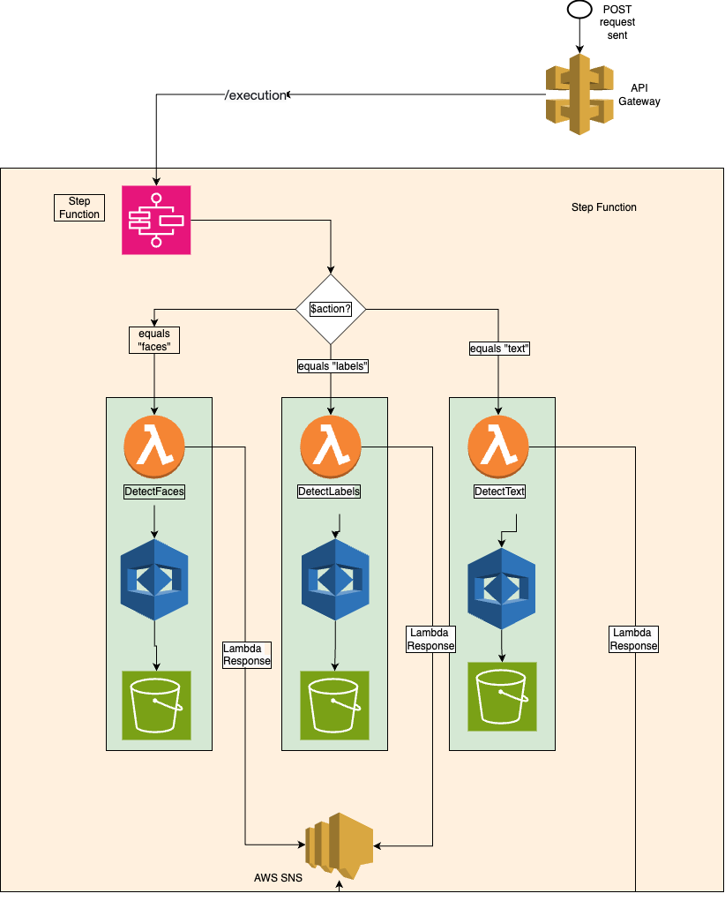

# AWS Serverless Image Processing Application

A serverless image processing application built with AWS services. The application analyzes images for faces, objects, and text using Amazon Rekognition, with automated notifications via SNS.

## Project Overview

This project demonstrates AWS serverless architecture through building an image processing pipeline that:
- Processes images stored in S3 buckets
- Uses Lambda functions for face detection, object labeling, and text extraction
- Orchestrates workflows with Step Functions
- Sends completion notifications via SNS

## Architecture

## Implementation

### Lambda Functions
- **DetectFaces.py**: Face detection and analysis
- **DetectLabels.py**: Object and scene recognition  
- **DetectText.py**: Text extraction from images

### AWS Services Used
- **S3**: Image storage
- **Lambda**: Serverless compute functions
- **Step Functions**: Workflow orchestration
- **API Gateway**: REST API endpoints
- **SNS**: Notification service
- **Rekognition**: AI image analysis

## Demo & Documentation

- **Video Demo**: [YouTube Demo](https://youtu.be/p056SV1m-cA)
- **Technical Analysis**: [Architecture Analysis PDF](image-processing-architecture-analysis.pdf)

## Skills Learned

### Technical Skills
- AWS S3 Bucket management
- AWS Lambda function development
- AWS Step Functions workflow design
- Amazon API Gateway configuration
- Amazon SNS notification setup
- Amazon Rekognition integration
- Python programming with boto3
- JSON data handling
- REST API development

### Soft Skills
- Self-guided research and learning
- Cost analysis and optimization
- Security considerations in cloud architecture

## Project Files

- `DetectFaces.py` - Face detection Lambda function
- `DetectLabels.py` - Object labeling Lambda function  
- `DetectText.py` - Text extraction Lambda function
